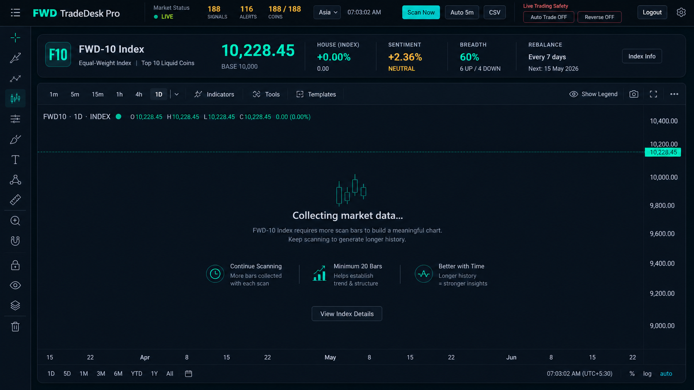

# FWD Bharat MarketDesk (NSE/BSE)

[](https://github.com/Flywithdhiraj/fwd-bharat-marketdesk/actions/workflows/ci.yml)
[](LICENSE)
[](docs/RELEASE_NOTES_v0.1.0.md)

Windows Electron desktop app for read-only Dhan market data, NSE/BSE scanning, option-chain analytics, chart review, manual trade planning, and local journals.

This project is open source under the MIT License. It is intended for research, market review, and manual planning workflows; it does not place broker orders.



## Current Status

- Framework: Electron desktop shell with Chrome-compatible renderer/runtime shims.
- Data source: Dhan Data API through native encrypted credentials.
- Trading mode: manual only. Dhan order placement, modify, cancel, DCA, and auto-trade paths are hard-blocked.
- Market data: Dhan instrument universe cache, LTP/quote/OHLC batching, historical/intraday candles with 90-day chunking, index tape, and read-only WebSocket tick parsing.
- Scanners: Wizard/Minervini, Stage, Radar, Reversal, Darvas, and Pullback labs run from shared NSE/BSE scan context.
- Options Hub: Dhan expiry lookup, CE/PE strike table, OI/PCR, IV skew, call/put walls, max pain, and read-only live-feed status.
- Calendar: native `market_session` action covers regular NSE/BSE timings and 2026 equity/F&O holidays, with Muhurat timing marked pending until exchange circular timing is published.
- Branding: app, raster icons, packaging metadata, and Windows `.ico` use `FWD Bharat MarketDesk`.
- Security: first launch can create a local app password and optional Microsoft Authenticator-compatible 6-digit login code with QR/manual setup. Private credential/data actions are blocked while the app is logged out.

## Why This Exists

Most retail trading utilities mix analysis with execution. FWD Bharat MarketDesk is intentionally narrower: it helps inspect India market data and prepare manual plans while keeping broker execution outside the app. The safety goal is simple: better review workflows without accidental live orders.

## Verification

The public checkpoint is continuously verifiable with:

```powershell
npm ci
npm run check
npm audit --omit=dev
```

The check suite covers read-only Dhan data behavior, manual-trading safety, scanner derivation, options analytics, chart review, visual smoke checks, and renderer bundle integrity.

## Commands

```powershell
npm ci
npm start
npm run check
npm run pack
npm run dist
```

## Open Source Maintenance

- Public repository: https://github.com/Flywithdhiraj/fwd-bharat-marketdesk
- Current release tag: `v0.1.0`
- Maintainer focus: safe read-only broker-data workflows, India market scanner quality, and transparent desktop packaging.
- Contributions are welcome for reliability, testing, accessibility, and documentation improvements.
- Roadmap: [docs/ROADMAP.md](docs/ROADMAP.md)
- Release notes: [docs/RELEASE_NOTES_v0.1.0.md](docs/RELEASE_NOTES_v0.1.0.md)

## Architecture Notes

1. Popup-to-background calls route through a desktop `BroadcastChannel` bridge.
2. Former service-worker modules run in a hidden same-origin frame to avoid variable collisions with popup scripts.
3. Settings and normal app data use desktop local storage through the Chrome-compatible shim.
4. Dhan credentials are stored through Electron `safeStorage` when available.
5. All broker execution remains outside the app; trade tickets and chart levels are planning aids only.

## Candle Storage And Laptop Migration

Daily, 4-hour, and weekly candles are stored in the native `candle-store` for every supported stock or instrument requested through the shared Dhan candle service. After the first backfill, later scans request only the missing tail with a small overlap and merge it into local history by timestamp.

To build long-term history, open **Settings → API Health → Daily + Weekly Historical Backfill**. Choose **F&O Stocks** or **All NSE Stocks**, then select **Start / Resume Backfill**. The app downloads up to ten years of daily candles in yearly batches, derives weekly candles locally, shows symbol/batch/row progress, and skips completed symbols when resumed. Dhan limits 4-hour history to the recent execution window, so long-term analysis uses the complete daily and weekly stores.

Normal chart opening reads local storage only. Use the chart **Refresh** button to download missing candles for that symbol. Full scans use the same stored daily history and request only the missing tail after a completed backfill.

Before changing laptops, open Settings and use **Export Laptop Backup**. The backup includes settings, Strategy Lab data, journals, and native candle files. On the new laptop, use **Restore on New Laptop**, restart the app, and enter API credentials again because encrypted credentials are intentionally machine-specific.

## Remaining External Work

- Save fresh DhanHQ credentials and test live REST/option-chain/WebSocket responses during market hours.
- Add a fundamentals provider/import source for ROCE, ROE, debt/equity, PE, EPS growth, and sector metadata.
- Update Muhurat/special-session timings when NSE/BSE publish the final circular.
- Run `npm run pack`/`npm run dist` after verification when a distributable build is needed.

## Distribution Notes

The app is buildable and installable, but it is not backed by a paid public code-signing certificate. Windows may still show a trust warning when distributed outside your machine.
