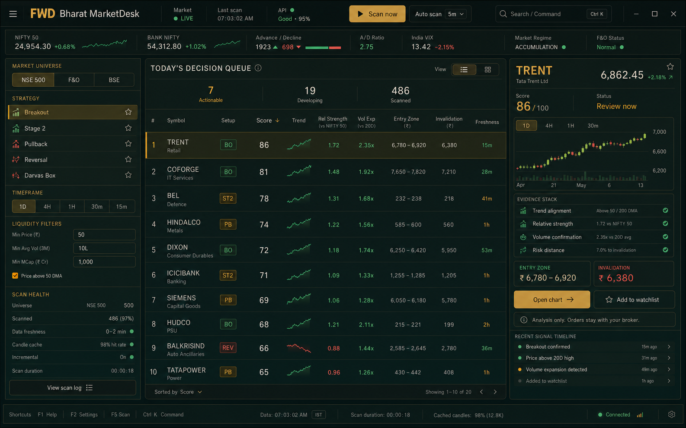

# Scanner design upgrade proposal

## Product direction

Make the scanner a decision workspace, not a collection of dashboards.

The primary workflow should answer three questions from left to right:

1. What market and strategy am I scanning?
2. Which symbols deserve attention now?
3. Why does the selected symbol qualify, and what invalidates the setup?

The recommended visual model is a calm, dense desktop cockpit with one dominant ranked queue. Keep the existing charcoal and olive palette, warm ivory text, amber accent, manual-only safety language, and compact geometry.

## Current strengths

- Mature read-only workflow with clear safety boundaries.
- Useful scanner views, score tiers, notices, and tabular output already exist.
- Tabular numerals and sticky table headers are established.
- Current gold, olive, and charcoal theme is distinctive and appropriate for Indian markets.
- Empty-state and scan-health thinking is already present.
- The app supports deep workflows without depending on a frontend framework migration.

## Main design problems

### 1. Too much shell before the result

Header, status bar, index ribbon, sector ribbon, workspace title, group controls, tabs, trust bar, readiness content, overview content, and capability shells can all appear before the ranked scanner output. Each band is defensible alone, but together they dilute the scanner's main job.

**Upgrade:** When the Scanner tab is active, collapse the global shell into a 56px command bar plus a 48px market tape. Move secondary status into the bottom status strip or a diagnostics drawer.

### 2. The ranked opportunity list is not the visual anchor

The current implementation supports card, front-table, and compact-table modes, but equal treatment of several views weakens the default hierarchy.

**Upgrade:** Make the ranked decision queue the canonical view. Keep cards as an optional review mode, not the first screen.

### 3. Evidence is distributed across rows, cards, modals, and chart actions

Users must mentally combine score, regime, reason text, policy, chart context, and risk levels.

**Upgrade:** Selecting a row should update a persistent right-side evidence inspector containing setup score, mini chart, qualification evidence, entry zone, invalidation, freshness, and timeline.

### 4. Filters behave like setup forms instead of a scanner instrument panel

Scanner universe, strategy, timeframe, liquidity, and health should stay visible while results change.

**Upgrade:** Use a sticky left rail separated by rules rather than nested cards. Show applied filters as readable controls, not a cloud of pills.

### 5. The CSS cascade has become expensive to reason about

The renderer currently imports 17 CSS layers and more than 34,000 lines of CSS. Several late theme files redefine the same typography, palette, radii, and scanner surfaces. Older cyan and blue rules remain underneath the current amber and olive correction layer.

**Upgrade:** Add scanner-specific semantic tokens, then consolidate scanner overrides into one final module. Do not redesign by adding another broad theme file.

## Target scanner layout

### Top command bar

- Product mark and active workspace.
- Market state, last scan, and API health.
- One primary `Scan now` action.
- Auto-scan interval.
- Command search and keyboard shortcut.

### Market tape

- NIFTY 50, BANK NIFTY, advance/decline, India VIX, and market regime.
- No boxes within boxes; use vertical dividers and tabular figures.
- Permit horizontal scrolling only on narrow windows.

### Left rail: scan definition

- Universe: NSE 500, F&O, BSE.
- Strategy: Breakout, Stage 2, Pullback, Reversal, Darvas.
- Timeframe and liquidity constraints.
- Scan health: universe count, coverage, freshness, cache hit rate, incremental state, duration.
- Sticky within the scanner viewport.

### Center: today's decision queue

- Default sort by actionable tier, score, and freshness.
- Columns: rank, symbol, setup, score, trend, relative strength, volume expansion, entry zone, invalidation, freshness.
- Use tiny inline charts only when they clarify trend.
- Selected row receives a 2px amber rail and quiet tinted background.
- Keep row density around 48-54px so 10-12 opportunities remain visible at 900px height.
- Add keyboard navigation: arrows move selection, `Enter` opens chart, `W` adds to watchlist, `/` focuses filters.

### Right rail: evidence inspector

- Symbol, company, live price, score, and review state.
- Compact chart with timeframe switch.
- Evidence rows for trend, relative strength, volume, market regime, and risk distance.
- Entry zone and invalidation as the strongest data pair.
- Primary `Open chart`, secondary `Add to watchlist`.
- Permanent note: `Analysis only. Orders stay with your broker.`
- Recent signal timeline.

### Bottom status strip

- Data timestamp, scan duration, cached candles, connection state, and shortcut help.
- Move low-priority operational detail here instead of creating more top-level bands.

## Visual system

### Typography

- Bundle `Geist` or `Satoshi` for UI text and `JetBrains Mono` for market numbers.
- Use 13px as the normal desktop UI size, 12px for table metadata, and 11px only for tertiary status.
- Avoid all-caps except short category labels.
- Use `font-variant-numeric: tabular-nums` globally for price, percentage, score, and time data.

### Color

- Background: `#0d110f`.
- Raised surface: `#141916`.
- Hover/selected surface: amber-tinted neutral, never bright gold fill.
- Primary accent: `#c9974d`.
- Positive: muted green.
- Negative: muted brick red.
- Remove remaining cyan and blue scanner states from older theme layers.

### Shape and depth

- Use 6-8px radii for controls and primary surfaces.
- Prefer dividers and spacing over standalone cards.
- Shadows only for overlays, drawers, menus, and detached windows.
- Use one consistent 1px border family.

### Motion

- 140-220ms transitions for hover, selection, and panel updates.
- Animate only opacity and transform.
- Scanner progress should update in place; do not move the table vertically.
- Use a subtle row highlight transition when rankings change.
- Respect `prefers-reduced-motion`.

## Required states

- First scan: composed explanation plus a clear `Run first scan` action.
- Scanning: stable table skeletons with live progress and current symbol.
- Partial data: preserve usable rows and annotate missing factors inline.
- Rate limited: show cooldown beside API health without blocking existing results.
- Empty result: explain which filters removed candidates and offer one-click relaxation.
- Stale data: mark affected rows and the inspector timestamp.
- Error: keep previous successful scan visible and show the failure non-destructively.

## Recommended build order

### Phase 1: hierarchy and shell

1. Create scanner mode shell with command bar, market tape, three-column workspace, and bottom status strip.
2. Reuse existing scanner data and actions without changing scan behavior.
3. Make the table the default view and preserve card/compact modes behind the view switch.

### Phase 2: evidence inspector

1. Add row selection state.
2. Populate the right inspector from existing signal, chart, score, and policy data.
3. Connect `Open chart`, watchlist, and manual-planning actions.

### Phase 3: filters and scan health

1. Move universe, strategy, timeframe, and liquidity controls into the left rail.
2. Add visible result counts and filter-impact feedback.
3. Keep scan progress spatially stable.

### Phase 4: design-system cleanup

1. Introduce scanner semantic tokens.
2. Remove obsolete scanner colors and duplicate late overrides.
3. Bundle the selected UI and mono fonts locally to satisfy CSP and offline use.

### Phase 5: finish quality

1. Add keyboard-first navigation and command search.
2. Add skeleton, partial, stale, empty, rate-limit, and error states.
3. Add screenshot-based visual regression coverage for 1440x900, 1280x800, and narrow desktop widths.

## Success measures

- A user can identify the top actionable symbol in under five seconds.
- A user can explain why it qualified without opening a modal.
- Entry and invalidation are visible before opening the full chart.
- At least ten ranked rows remain visible at 1440x900.
- The scanner can be operated by keyboard for the core review loop.
- No market result is hidden or lost when a refresh, API cooldown, or partial-data error occurs.

